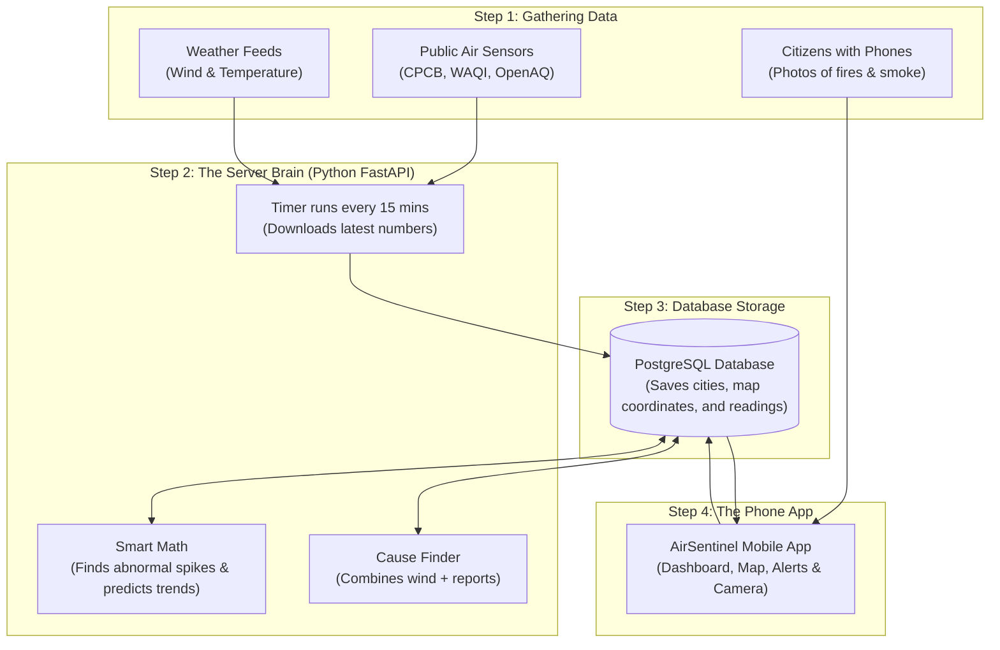

# AirSentinel 🛰️💨

> **A Simple Mobile App to Track Air Pollution, Predict Bad Air, and Report Smoke in Your Neighborhood.**  
> *Know what you breathe, find out why the air is dirty, and help protect your city.*

---

## 🌟 Quick Summary (What is this project in 30 seconds?)

Most weather apps only show you **one single air pollution number** from an official station that might be 20 kilometers away from your house. But air pollution changes from street to street! If someone is burning trash two streets away, your phone's normal weather app won't know.

**AirSentinel** fixes this problem:
1. It **combines live data** from multiple official stations and weather feeds into one accurate local number.
2. It uses **smart math (AI)** to warn you if air pollution is suddenly spiking or getting worse.
3. It figures out **why the air is dirty** (e.g., heavy traffic vs. trash smoke vs. dust) by checking wind and weather.
4. It lets **regular people snap a photo of smoke or burning garbage** to report it with their phone's GPS location.

---

## 🚀 Features (What We Built & Why We Built It)

Here is every main feature of AirSentinel explained in simple everyday words:

---

### 1. 📱 The Live Dashboard (Home Screen)
* **What it does:** Shows your current local Air Quality score (AQI) with a clear color (Green = Good, Yellow = Moderate, Red = Dangerous) and lists key pollutants like fine dust (PM2.5) and car exhaust (NO2).
* **Why we built it:** People don't want to read a complicated scientific report just to know if they can go for a morning jog. This screen tells you if the air is safe to breathe in 2 seconds.
* **How to say it in your presentation:**  
  > *"It works like a speedometer for clean air. Green means safe, red means stay inside."*

---

### 2. 🗺️ Interactive Air Quality Map
* **What it does:** An interactive map of the city showing air quality stations and color-coded zones from clean to dirty.
* **Why we built it:** Smoke travels with the wind. The map lets you see which areas of your city are clean and which are polluted before you drive to work or travel.
* **How to say it in your presentation:**  
  > *"It’s like Google Maps traffic, but instead of showing traffic jams, it shows smoke and pollution clouds."*

---

### 3. 📸 Citizen Smoke & Fire Reporter
* **What it does:** Allows any user to open their camera, take a picture of a pollution source (like burning garbage, construction dust, or factory smoke), and submit it with their exact location.
* **Why we built it:** Government air sensors are expensive and rare. A sensor will never catch someone burning plastic in a back alley. By letting citizens take pictures and report, the whole community helps find pollution hotspots.
* **How to say it in your presentation:**  
  > *"Sensors are fixed in one place, but citizens are everywhere. We turn every smartphone into a pollution detector."*

---

### 4. 🧠 Smart Anomaly & Hotspot Finder (AI)
* **What it does:** Compares air quality across multiple cities and neighborhoods. If one area suddenly jumps from 100 to 350 while everywhere else is normal, the system flags it as an abnormal hotspot.
* **Why we built it:** Big spikes mean an emergency is happening—like a chemical fire, a pile of tires burning, or sudden illegal factory dumping. The system finds these automatically.
* **How to say it in your presentation:**  
  > *"Instead of humans checking numbers all day, our smart code spots sudden pollution jumps automatically."*

---

### 5. 📈 Future Spike Prediction (Will it get worse?)
* **What it does:** Checks recent readings (for example, whether the number has been climbing steadily over the last few hours) and predicts if the air is going to cross dangerous health levels soon.
* **Why we built it:** Warning people *after* the air becomes toxic is too late. If the app warns you an hour in advance, you can close your windows or turn on your home air purifier before the bad air gets inside.
* **How to say it in your presentation:**  
  > *"It doesn't just tell you how bad the air is right now—it predicts if it's about to get worse."*

---

### 6. 🔍 "Why is the air bad?" (Source Finder)
* **What it does:** Looks at live wind speed from weather stations and combines it with recent citizen smoke reports to guess the likely cause of the dirty air (e.g., *"Likely Cause: Traffic fumes trapped by zero wind"* or *"Likely Cause: Local trash fire reported nearby"*).
* **Why we built it:** Knowing the air is bad isn't enough. People and city officials want to know *who or what* is causing it so action can be taken.
* **How to say it in your presentation:**  
  > *"We don't just measure the smoke; we use wind and reports to trace where it came from."*

---

### 7. 🔔 Instant Health Alerts & Notifications
* **What it does:** Sends an alert to your phone when air quality reaches dangerous levels, when clean air returns, or when someone reports a fire near you.
* **Why we built it:** You shouldn't have to keep opening the app all day. The app lets you know when your health is at risk.
* **How to say it in your presentation:**  
  > *"It acts like a smoke alarm for your city."*

---

### 8. 🏥 Plain-English Health Advice
* **What it does:** Tells you directly what to do based on the air quality: *"Safe for outdoor workouts"*, *"Sensitive groups should wear an N95 mask"*, or *"Keep windows closed today"*.
* **Why we built it:** Most people don't know what a number like "AQI 185" actually means for their body. Giving clear doctor-style advice makes the data useful for real life.
* **How to say it in your presentation:**  
  > *"We translate raw sensor numbers into simple medical advice that anyone can follow."*

---

### 9. ⏱️ 15-Minute Automatic Refresh
* **What it does:** A background program on our server runs automatically every 15 minutes to pull the latest weather and air data.
* **Why we built it:** Nobody has to press a button to refresh the server. The data is always fresh and ready when a user opens their phone.

---

### 10. 🔐 Easy Passwordless Login
* **What it does:** You type your email and receive a 6-digit code to log in immediately. No password needed.
* **Why we built it:** People forget passwords. Entering a quick code from an email is fast, simple, and very secure.

---

## 💻 Tech Stack (What Tools We Used in Plain English)

| Tool / Technology | What is it? (Simple words) | Why did we use it? |
| :--- | :--- | :--- |
| **React Native + Expo** | The mobile app builder | Lets us write code once and run it on both **Android phones and iPhones**. |
| **TypeScript** | Clean programming language for the app | Helps catch typos and bugs while writing the code so the app doesn't crash. |
| **Glassmorphism Design** | Frosted glass look & dark mode | Makes the app look beautiful, modern, and high-tech rather than plain and boring. |
| **Leaflet & WebView** | Free, interactive map engine | Shows the map on your phone without needing expensive Google Maps licenses. |
| **Python & FastAPI** | The backend server (the brain) | Super fast web server in Python that answers the app's requests in a fraction of a second. |
| **PostgreSQL Database** | The memory storage | A rock-solid storage system to save user accounts, city names, reports, and readings. |
| **PostGIS** | The GPS / map calculator | A database tool that understands geographic coordinates. It can calculate: *"Which sensor is within 5 kilometers of this user?"* in milliseconds. |
| **NumPy (Math Library)** | Fast calculator in Python | Calculates averages and flags abnormal pollution spikes (AI anomaly score). |
| **APScheduler** | The automatic alarm clock on the server | Wakes up the server every 15 minutes to download new air readings and weather. |
| **Supabase Auth** | The security guard | Sends login codes to your email and checks that users are who they say they are. |
| **Open-Meteo API** | Free live weather service | Tells our server the live wind speed, wind direction, and temperature. |
| **CPCB, WAQI & OpenAQ** | Public air pollution sensors | Public networks providing live measurements from government and international air stations. |

---

## 🏗️ How the Whole System Works (Simple Flow)

Here is how data moves through AirSentinel step by step:



1. **Step 1:** External sensors measure the air, weather services measure the wind, and citizens report local fires.
2. **Step 2:** Our Python server downloads this data every 15 minutes and runs smart math to check for sudden spikes.
3. **Step 3:** Everything is safely stored in our database with exact GPS coordinates.
4. **Step 4:** When you open your phone, the app gets clean, instant answers and shows them on your screen.

---

## 🎤 Ready-to-Use Presentation Slides (Copy & Paste for Your Talk)

Use these 7 slides for your presentation. Each slide has **Bullet Points** to put on the screen and **What to Say** out loud:

### 🔹 Slide 1: Introduction
* **Screen Title:** AirSentinel — Real-Time Air Quality & Community Action
* **Subtitle:** Knowing what you breathe, predicting bad air, and reporting pollution together.
* **What you say:**  
  > *"Hello everyone. Today I am presenting AirSentinel, a mobile platform that helps people know what they are breathing, warns them before dangerous pollution spikes arrive, and empowers communities to report local pollution hazards."*

---

### 🔹 Slide 2: The Real-World Problem
* **Screen Bullet Points:**
  - Official air sensors are far apart and miss neighborhood events.
  - Trash burning, construction dust, and traffic jams happen at street level.
  - People find out the air is bad only after they have already breathed it in.
* **What you say:**  
  > *"Air pollution changes from street to street. A government sensor 15 kilometers away will never detect someone burning plastic or tires around your corner. By the time the news talks about bad air, your lungs have already suffered."*

---

### 🔹 Slide 3: Our Solution: AirSentinel
* **Screen Bullet Points:**
  - One clean app for real-time local air ratings.
  - Interactive map showing pollution clouds.
  - Crowdsourced reporting: Take a picture of smoke with your phone.
  - Smart alerts that warn you before the air gets dangerous.
* **What you say:**  
  > *"AirSentinel solves this by bringing official sensor data and community reporting together on one mobile app with smart early warnings."*

---

### 🔹 Slide 4: Key App Features
* **Screen Bullet Points:**
  - **Live Dashboard:** Clean color-coded air quality score in 2 seconds.
  - **Interactive Map:** Zoom into neighborhoods to check smoke spread.
  - **Citizen Camera:** Snap photos of illegal burning or factory smoke with GPS.
  - **Health Advice:** Clear doctor-recommended tips like when to wear a mask.
* **What you say:**  
  > *"The user gets a clean dashboard with green, yellow, and red safety indicators, an interactive map, and a built-in camera tool so anyone can report pollution in their neighborhood."*

---

### 🔹 Slide 5: The Smart Math & AI Layer
* **Screen Bullet Points:**
  - **Abnormal Spike Detection:** Flags sudden jumps in pollution.
  - **Trend Prediction:** Guesses if air will worsen in the next few hours.
  - **Cause Finder:** Combines wind direction with citizen reports to explain *why* the air is bad.
* **What you say:**  
  > *"Our system does not just show raw numbers. It analyzes the trend to predict if a spike is coming, and it uses wind direction to explain whether the dirty air is caused by traffic or a nearby fire."*

---

### 🔹 Slide 6: Our Technology Stack
* **Screen Bullet Points:**
  - **Frontend:** React Native & Expo (Works on Android & iOS).
  - **Backend:** Python FastAPI (Fast, modern server).
  - **Database:** PostgreSQL + PostGIS (Handles map and GPS coordinates).
  - **Scheduler:** APScheduler (Refreshes data automatically every 15 minutes).
  - **Login:** Supabase Auth (Secure 6-digit email code).
* **What you say:**  
  > *"On the technical side, we built a cross-platform mobile app using React Native and Expo. Our backend is written in Python using FastAPI for speed, and we use PostgreSQL with PostGIS to perform geographic distance calculations."*

---

### 🔹 Slide 7: Conclusion & Impact
* **Screen Bullet Points:**
  - Protects vulnerable citizens (asthma patients, children, elderly).
  - Creates crowdsourced accountability for cleaner cities.
  - Simple, fast, and ready to scale.
* **What you say:**  
  > *"AirSentinel turns passive citizens into active environmental protectors. It helps families protect their health and helps cities stay cleaner. Thank you, and I am happy to take questions!"*

---

## 📁 Simple Project Folder Guide

```
AirSentinel/
├── app/                          # THE MOBILE PHONE APP
│   ├── components/               # Buttons, Cards, and Map widgets
│   ├── context/                  # Login state and Dark/Light theme
│   ├── lib/                      # Code that calls the backend server
│   ├── navigation/               # Navigation menus and bottom tabs
│   └── screens/                  # The phone screens
│       ├── HomeScreen.tsx        # Main live air score dashboard
│       ├── MapScreen.tsx         # Interactive city map
│       ├── ReportScreen.tsx      # Take a photo and report pollution
│       ├── AlertsScreen.tsx      # Warning notifications
│       └── SignInScreen.tsx      # Email login
│
└── backend/                      # THE SERVER & BRAIN
    ├── app/
    │   ├── api/                  # The endpoints the phone talks to
    │   │   ├── aqi.py            # Calculates current air quality
    │   │   ├── ai_hotspots.py    # Finds sudden pollution spikes
    │   │   ├── predictions.py    # Predicts upcoming spikes
    │   │   ├── attribution.py    # Figures out why the air is bad
    │   │   └── reports.py        # Saves citizen smoke reports
    │   ├── jobs/ingest.py        # Background script running every 15 mins
    │   └── models/models.py      # Database tables (Users, Cities, Reports)
```

---

## 🛠️ How to Run the Project on Your Computer

### 1. Start the Backend Server (Python)
```bash
cd backend
python -m venv .venv

# Activate environment:
.\.venv\Scripts\activate      # on Windows
# source .venv/bin/activate   # on Mac/Linux

# Install required packages:
pip install fastapi uvicorn sqlalchemy geoalchemy2 psycopg2-binary pyjwt requests python-dotenv apscheduler httpx numpy shapely

# Create database tables and load cities:
python app/create_tables.py
python app/seed_cities.py

# Run the server:
python -m uvicorn app.main:app --reload --host 0.0.0.0 --port 8000
```

### 2. Start the Mobile App (Expo)
```bash
cd app
npm install

# Start the app:
npx expo start --clear
```
*(Scan the QR code with the Expo Go app on your phone to open it immediately!)*
